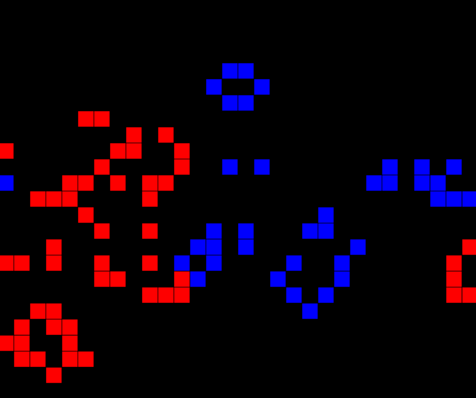

# Battle_of_life

## Battle of Life

L'objectif de ce projet est de développer un jeu de notre invention nommé Battle of Life s'appuyant sur le principe du [jeu de la vie de Conway](https://www.google.com/url?sa=t&rct=j&q=&esrc=s&source=web&cd=&cad=rja&uact=8&ved=2ahUKEwi80qqi7K37AhVIhv0HHcgUC1YQFnoECBEQAQ&url=https%3A%2F%2Ffr.wikipedia.org%2Fwiki%2FJeu_de_la_vie&usg=AOvVaw24h90rHeSmjYpuCat_8q8M).

## Description

Battle of Life est un jeu en 1 contre 1 utilisant le principe du jeu de la vie de Conway. Le jeu de la vie est un automate cellulaire imaginé par John Horton Conway au début du 19ème siècle. C'est probablement le plus connu de tous les automates cellulaires qui sont des modèles où chaque état conduit mécaniquement à l'état suivant à partir de règles pré-établies. Dans la version que l'on propose ici, les cases de l'automate auront 3 états possibles : morte, rouge ou bleu. Cela va donc consituter deux armées qui s'affronteront selon différents modes : contamination, gestes barrières, army et labirinth.

Un exemple du jeu de la vie de Conway:

# Règles principales:
L'univers où évoluent les cases est une grille à deux dimensions sous la forme d'un tore(il n'y a pas de bords. Sur notre grille, la première colonne sera voisine de la dernière et la première ligne sera voisine de la dernière.). Les cellules peuvent prendre 3 états distincts: mort,rouge,bleu. 

La transformation d'une cellule à savoir la survie, la naissance,la mort ou la contamination est entièrement déterminée par l'état de ses 8 voisines. Elle se fait selon les règles suivantes:
    
-une cellule morte possède exactement 3 voisins vivants :arrow_right: la cellule prend la couleur de la majorité parmi ses voisins (**naissance** :white_check_mark:)
    
-une cellule vivante possède strictement moins de 2 voisins vivants ou strictemet plus de 3 voisins vivants :arrow_right: la cellule meurt (**sous/surpopulation** :x:)

-une cellule vivante possède 2 ou 3 voisins vivants (**survie** :ballot_box_with_check:):

:black_small_square: mode geste barrière :mask: : la cellule reste vivante et garde sa couleur 

:black_small_square: mode contamination :biohazard: : la cellule prend la couleur de la majorité parmi ses voisins, si égalité elle garde sa couleur initiale

:black_small_square: ...

# Installation
Pour exécuter ce projet, il est nécessaire d'avoir installé [Python](https://www.python.org/downloads/) ainsi qu'un éditeur de code ( par exemple [Visual Studio Code](https://github.com/hudelotc/CentraleSupelec_CodingWeeks_2020/blob/main/VisualStudioCode.md)).

## Instruction

Pour faire tourner le programme, il suffit d'éxecuter le fichier __main__.py qui se trouve à la racine du projet.

## Auteurs

Les auteurs de ce projet sont :

-Anthony Decambray (@anthony.decambray)

-Lutèce Bilot (@lutece.bilot)

-Thibault Gelle (@thibault.gelle)

-Thomas Idier (@thomas.idier)

-Alexis Lombard-Gaillard (@alexis.lombard-gaillard)

-Alexandre Valat (@alexandre.valat)

